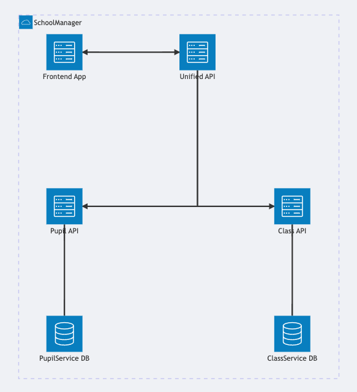
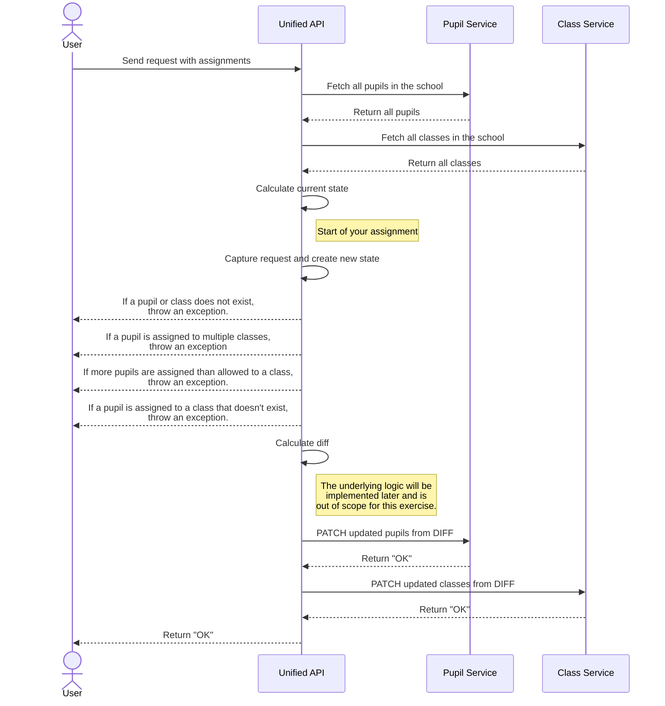

# SchoolManager

This exercise is part of a technical interview for a Backend Engineer at In The Pocket.

Let's say ITP builds software for schools: the well-known `SchoolManager`. It's a state of the art .net application, built on top of `.net 8`. With this piece of software, principals can manage their school, classes and pupils.

Our users requested a new feature that principals can use in the beginning of the school year to assign pupils to a single class.

Lenny, the team's design engineer, drafted a **very fancy UI** of how it should look like. It contains dragging and dropping, but you - as a backend engineer - shouldn't care about those things of course. This short video displays how the final result should look like.

The backend application is a distributed system that has multiple microservices that are linked to eachother through a RestFUL API `Unified API` to which the frontend applications talk (both mobile and web).

The underlying RestFUL services are secured and are not accessed directly by the frontend or the user. These services at first glance, seem overkill but are designed like this because of reasons (scaling, security, handling load, separation of concerns, ...).

The Pupil data resides in a single microservice (`PupilService`), and the Class data does as well (`ClassService`). There are no direct hard links between the microservices and each of them has their own database.

### Architecture

A simplified version of our architecture and database is documented below.

As you see, the UI our design engineer created, combines data from 2 microservices at once.
Our System Architect thaught of a way to make this process as clean and performant as possible.
It's your job to implement the new feature and make sure the Unified API processes the request correctly and creates instructions in the form of `classesToUpdate` and `pupilsToUpdate`, that can be used to call the underlying microservices.

Your colleagues provided a lot of code already: all the models are present in the codebase. You don't have to worry about databases, data, HTTP calls or any of that. The only thing missing is the implementation of the `PupilClassManager` methods, the actual core of the feature.
The Unit Tests are also provided of what the business Logic inside the `./Services/PupilClassManager.cs` file is supposed to do.

## Sequence Diagram

## Assignment

What we request from you is;

- [ ] Add the required implementation in the `./Services/PupilClassManager.cs` to make the unit tests that are defined in `./Tests/PupilClassManagerTests.cs` pass.
- [ ] Use git and commit your changes, preferably in a Merge or Pull Request.
- [ ] Make sure to document your code as much as possible.
- [ ] **Bonus**: Provide of a (theoretical) way to achieve data consistency, when something for example might fail.
- [ ] **Bonus**: Run your tests automatically on Pull Request
- [ ] **Bonus**: Convert the current application to a RestFUL API with 2 endpoints: `GET /state` and `PATCH /state`

If you find the time, you're of course welcome to optimize the existing codebase.

When you're done, you can submit this case to your contact at In The Pocket's Talent Team.
