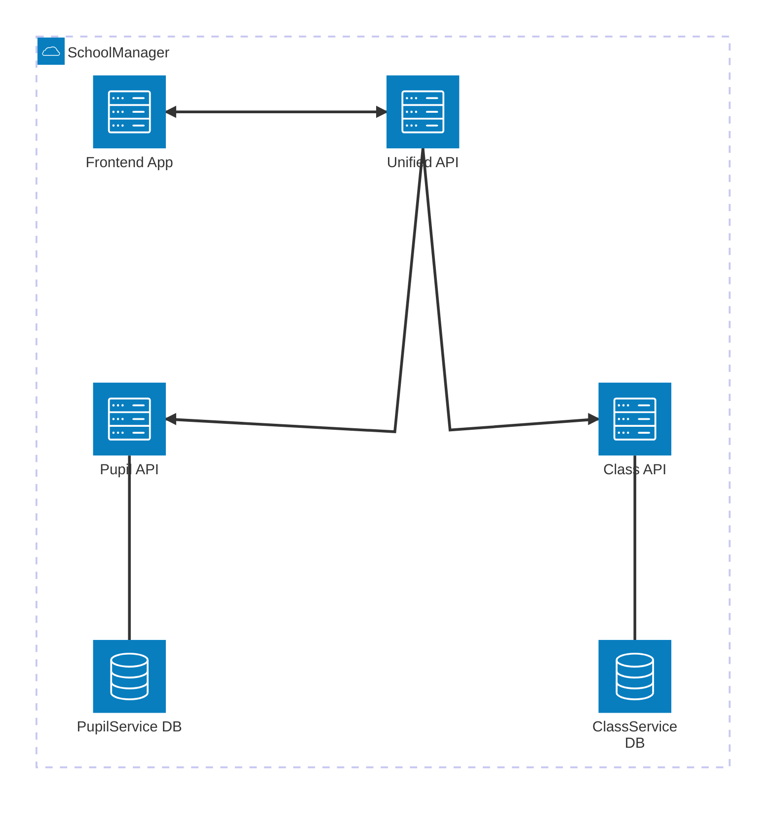

```mermaid
architecture-beta

service frontend(server)[Frontend App]

group api(cloud)[SchoolManager]
  service unifiedApiService(server)[Unified API] in api
  service pupilService(server)[Pupil API] in api
  service pupilServiceDb(database)[PupilService DB] in api
  service classService(server)[Class API] in api
  service classServiceDb(database)[ClassService DB] in api

  unifiedApiService:B --> R:pupilService
  pupilService:B -- T:pupilServiceDb
  unifiedApiService:B --> L:classService
  classService:B -- T:classServiceDb

frontend:R <--> L:unifiedApiService
```
